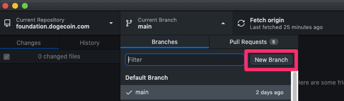
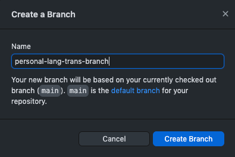

# How To Add a Project to the Dogecoin.org Website

- [How To Add a Project to the Dogecoin.org](#how-to-add-a-project)
  - [Apply for adding a project](#apply-for-adding-a-project)
  - [Apply for a sub domain your-project.dogecoin.org](#apply-for-adding-a-sub-domain)
  - [Get the code](#get-the-code)
  - [Checkout a new branch](#checkout-a-new-branch)
    - [Command-line](#command-line)
    - [GUI](#gui)
    - [Markdown Editor](#markdown-editor)
  - [Update config.toml](#update-configtoml)
  - [Update flags.html](#update-langflags)
  - [Translation](#translation)
  - [Test translation](#test-translation)
  - [Pull Request](#pull-request)
  - [PR Review](#pr-review)
  - [Merge to main branch](#merge-to-main-branch)

## Apply for adding a project

* Apply for adding your project access through Discord.

## Apply for a sub domain your-project.dogecoin.org

* Apply for a sub domain your-project.dogecoin.org through Discord.

## Get the code

* Get the code by following the steps in '[How To Get Dogecoin Website](how-to-get-website.md)

## Checkout a new branch

* Checkout a new branch for you local translation, eg. ```personal-lang-trans-branch```.


### Command-line

```
git checkout -b personal-lang-trans-branch
```

### GUI

* Current Branch (main) -> New Branch

* Name the new branch


### Markdown Editor
* Any mainstrem markdown editor is suitable for processing the translation tasks.

## Update config.toml

* Open file '```config.toml```' at root path.
* Add according language (eg. translated-lang) in ```[languages]``` section.
* Add menu items of Home Page in your 'translated-lang' section (eg. ```zh-cn``` is ```[languages.zh-cn.menu]``` and following ```[[languages.zh-cn.menu.main]]```).

## Update flags.html

* Open file '```themes/dogecoin.org/layouts/partials/flags.html```'.
* Add according language (eg. translated-lang) in ```flags.html```.


## Translation

* Copy the original english (markdown format) files from ```content/en/```,  (eg. ```introduction.md```) and paste as the to-be-translated-files (eg. ```content/translated-lang/much-start-coding/dogecoin-core/introduction.md```), translate them then.
* If there are some updates on the ```main``` branch during your translating process, you should merge them to your personal-trans-branch first (resolve conflicts as well), to make sure your translation is update-to-date.

## Test translation

* Run the website locally by following the steps in [How To Run Dogecoin Website](how-to-run-website.md) to test the translation, make sure it will work as expected.

## Pull Request

* Submit changes as PR, then mention your PR in the channel ```website``` on Discord.


## PR Review

* It's ideal to do ```peer review``` if there are at least TWO peers who are familiar with the same language translations.
* If ONLY the translator is familiar with the translated laguage, then there should be at least another TWO reviewer to be requested to do the review task.

## Merge to main branch

* Once the review PASS, then the ORIGINAL translator should do the ```merge``` action from ```personal-lang-trans-branch``` to ```main``` branch.
* Remember to resolve conflict if there happens.